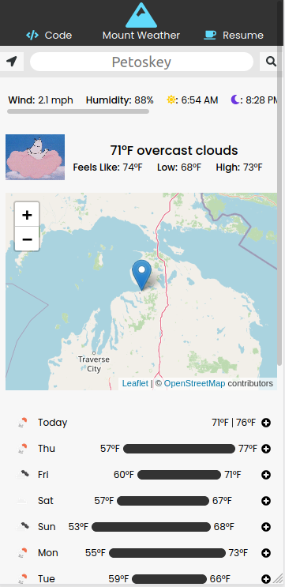
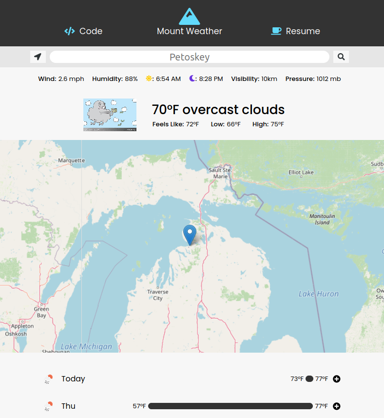

# Mount Weather

A simple weather app built with React - using the OpenWeatherMap API.

## Screenshots

## Usage

`$ npm install`

#### Todo

- Load default coords if user does not consent.
- Setup form to get coords from human readable query (Boston, MA)
- Allow user to switch between the two units of measurement (F & C)
- Create a 'weather bar' using the hourly data provided by the 'one call'.
- Integrate map with weather tile layer (thats a tough one).
- Build a nice README.md to show off the project.

#### - The Odin Project -

Big shoutout to The Odin Project for the inspiration and resources which made this project possible.
https://www.theodinproject.com/courses/javascript/lessons/weather-app
